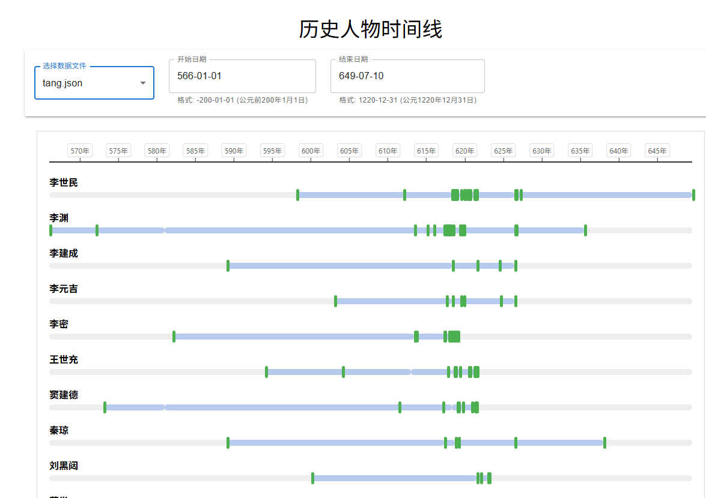

本项目以时间轴形式并行展示多位历史人物的生平事件与状态时段。当鼠标悬停在状态条或事件标记上时，页面右下角或左下角将显示对应的详细描述，包括状态说明或事件详情。

目前已有隋末唐初、唐末五代至宋初时期的数据，并实现可视化展示。下一步计划完善秦末汉初部分，后续扩展内容仍在规划中。

## 启动方法
1. 本地启动
进入 src 目录，运行以下命令即可启动项目：

2. Codespaces启动
首先进入项目首页，点击Codespaces

进入Codespaces后等待初始化完毕，输入以下命令：
npm install @mui/material @emotion/react @emotion/styled
npm start
此时下方会提示开启新画面，点击即可。

`npm start`
## 使用方法
页面中提供“开始时间”和“结束时间”输入框，用户可手动输入日期，或通过日历控件选择。

> 注：因古代历史记录通常较为粗略，本程序默认使用农历日期。若史书未明确记载月份，则记为1月；若未记载具体日期，则记为1日。

人物状态与事件数据存储于 `src/data` 目录下的 JSON 文件中，用户可据此灵活修改或添加数据。

可通过页面顶部的下拉菜单切换不同朝代的数据视图，也可自定义时间轴范围。如需调整数据，请直接修改相应 JSON 文件。

## 示例效果
